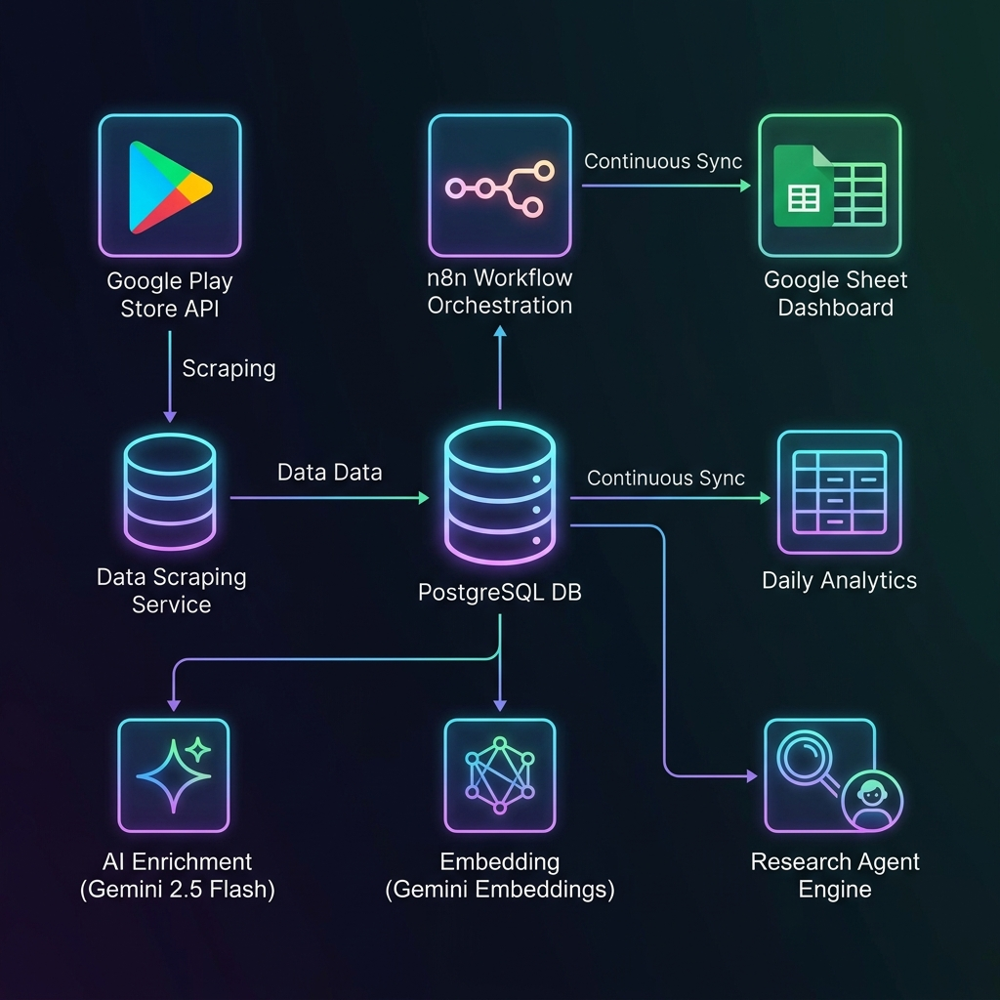

# Spotify Voice of Customer (VoC) Scraper & Analyzer

This document provides a comprehensive overview of the architecture, database schema, data ingestion pipeline, and AI analysis capabilities built for the Spotify Google Play Store VoC Platform.

---

## 1. System Architecture Diagram

The system operates as a scheduled ETL and AI synthesis pipeline orchestrated by **n8n**, utilizing **PostgreSQL** for storage/retrieval, **Gemini APIs** for enrichment and semantic search, and **Google Sheets** for real-time visualization.



---

## 2. Core Components Built

### 📁 1. Database Layer (`database/`)
*   **[connection.py](file:///Users/likhityadav/Documents/NL-%20Spotify/database/connection.py):** Handles active database connections and context managers for database transactions. 
*   **[schema_enrichment.sql](file:///Users/likhityadav/Documents/NL-%20Spotify/database/schema_enrichment.sql):** Defines the `review_analysis` table (sentiment, theme JSON, frustrations JSON, jobs-to-be-done JSON) and daily aggregate counters for trend tracking.
*   **[schema_embeddings.sql](file:///Users/likhityadav/Documents/NL-%20Spotify/database/schema_embeddings.sql):** Installs and configures the `pgvector` extension and creates the `review_embeddings` table storing 3072-dimensional vector arrays.
*   **[schema_agent.sql](file:///Users/likhityadav/Documents/NL-%20Spotify/database/schema_agent.sql):** Implements a SHA-256 query cache table to avoid redundant LLM synthesis costs.

### 🕷️ 2. Play Store Scraper (`scraper/`)
*   **[play_store.py](file:///Users/likhityadav/Documents/NL-%20Spotify/scraper/play_store.py):** Wraps `google-play-scraper` to pull the newest reviews for any specified `country` (e.g. `'in'`, `'us'`), `language`, and `count`. Saves reviews using `ON CONFLICT (review_id) DO NOTHING` to filter out duplicates.

### 🧠 3. AI Enrichment Pipeline (`enrichment/`)
*   **[pipeline.py](file:///Users/likhityadav/Documents/NL-%20Spotify/enrichment/pipeline.py):** Retrieves unenriched reviews in batches, prompts `gemini-2.5-flash` with a strict JSON schema, classifies sentiment (`positive`, `neutral`, `negative`), extracts themes and frustrations, identifies user segments, and creates summaries.

### 🔢 4. Vector Embedding Generator (`embeddings/`)
*   **[generator.py](file:///Users/likhityadav/Documents/NL-%20Spotify/embeddings/generator.py):** Combines raw reviews and structured analysis into semantic chunks, generates 3072-dimensional vectors using `gemini-embedding-2`, and stores them in PostgreSQL.

### 🤖 5. Hybrid Research Agent (`agent/`)
*   **[tools.py](file:///Users/likhityadav/Documents/NL-%20Spotify/agent/tools.py):** Exposes safe data-access tools: SQL select execution, schema inspection, vector similarity searches using cosine distance (`<=>`), and Python evaluation environments.
*   **[engine.py](file:///Users/likhityadav/Documents/NL-%20Spotify/agent/engine.py):** Pulls schema metadata, executes SQL aggregate statistics, performs vector semantic search, and prompts Gemini to compile comprehensive, evidence-grounded research reports.

### 🔗 6. n8n Integration & Visualization (`n8n/`)
*   **[spotify_pipeline.json](file:///Users/likhityadav/Documents/NL-%20Spotify/n8n/workflows/spotify_pipeline.json):** Coordinates the execution order on a scheduler.
*   **Postgres-to-Google Sheets Sync:** An n8n node combination that runs a SQL `LEFT JOIN` between reviews and analyses, and uses the Google Sheets node to **Append or Update** rows dynamically.

---

## 3. Database Schema

### `play_store_reviews` (Raw Ingestion)
| Column Name | Type | Description |
| :--- | :--- | :--- |
| `review_id` | `TEXT` (PK) | Unique identifier assigned by Google Play Store. |
| `app_name` | `TEXT` | Name of the app (e.g., 'Spotify'). |
| `review_text` | `TEXT` | Raw review content left by the user. |
| `rating` | `INTEGER` | Rating score from 1 to 5. |
| `thumbs_up` | `INTEGER` | Number of users who marked this review helpful. |
| `review_date` | `TIMESTAMP` | When the review was published. |
| `app_version` | `TEXT` | Installed version of the app. |
| `country` | `TEXT` | Target country of the Play Store (e.g., `'in'`, `'us'`). |
| `source` | `TEXT` | Ingestion source (defaults to `'play_store'`). |
| `inserted_at` | `TIMESTAMP` | Database insertion timestamp. |

### `review_analysis` (AI Enrichment)
| Column Name | Type | Description |
| :--- | :--- | :--- |
| `review_id` | `TEXT` (PK, FK) | Reference to `play_store_reviews`. |
| `sentiment` | `TEXT` | `'positive'`, `'neutral'`, or `'negative'`. |
| `themes` | `JSONB` | Array of strings (e.g., `["music_discovery"]`). |
| `frustrations` | `JSONB` | Array of strings (e.g., `["ai_slop_content"]`). |
| `jobs_to_be_done` | `JSONB` | Array of user goal statements. |
| `user_segment` | `TEXT` | Identified listener cohort. |
| `listening_behavior`| `TEXT` | User's listening habit category. |
| `summary` | `TEXT` | Concise 1-sentence summary. |
| `analyzed_at` | `TIMESTAMP` | Analysis creation timestamp. |

---

## 4. How to Run & Orchestrate

### A. Environment Configuration
Create a `.env` file in the root workspace folder:
```env
# Gemini API Keys
GEMINI_API_KEY=your_gemini_api_key_here
GOOGLE_API_KEY=your_gemini_api_key_here

# Local PostgreSQL Configuration
DB_HOST=localhost
DB_PORT=5432
DB_NAME=spotify_voc
DB_USER=likhityadav
DB_PASSWORD=
```

### B. Ingesting & Processing via CLI
To process reviews manually, execute:
```bash
# 1. Initialize DB tables & run migrations
.venv/bin/python cli.py setup-db

# 2. Scrape reviews (1000 Indian reviews)
.venv/bin/python cli.py scrape --count 1000 --country in

# 3. Categorize reviews with Gemini
.venv/bin/python cli.py enrich --limit 1000 --batch-size 50

# 4. Generate search vectors
.venv/bin/python cli.py embed --limit 1000

# 5. Compile trend stats
.venv/bin/python cli.py update-stats
```

### C. Querying the Research Agent
To compile an evidence-based report answering a PM question:
```bash
.venv/bin/python cli.py ask -q "Why do users struggle to discover new music?"
```

---

## 5. Google Sheets Live Dashboard Sync

The n8n pipeline includes a reporting layer that outputs data directly to Google Sheets:
1.  **Postgres Action (Execute Query):** Merges raw reviews with AI details using:
    ```sql
    SELECT 
        r.review_id, r.review_date, r.rating, r.review_text, r.country,
        ra.sentiment, ra.themes::text, ra.frustrations::text, ra.user_segment
    FROM play_store_reviews r
    LEFT JOIN review_analysis ra ON r.review_id = ra.review_id
    ORDER BY r.review_date DESC;
    ```
2.  **Google Sheets Action (Append or Update Row):** 
    *   **Document:** Connects to `Spotify - play store reviews` spreadsheet.
    *   **Matching Column:** Uses `review_id` to detect duplicates. If a review exists, it updates it. If not, it adds a new row. This ensures your dashboard matches the database perfectly.
